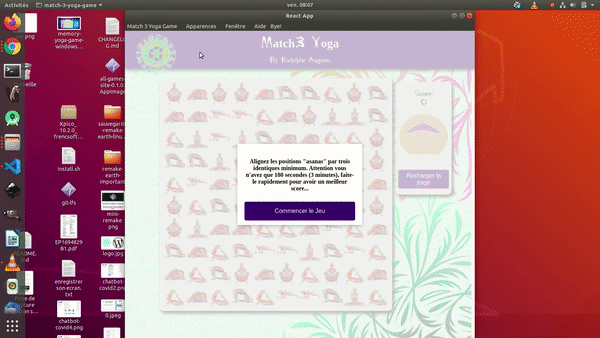
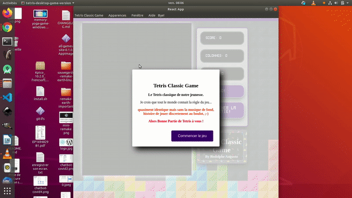

# Jeux libres de droits "open Sources"

***Memory Yoga Cards Game***

***Sort the Waste Game***

***Match 3 Yoga Game***

***Tetris Classic Game***

***Remake Earth Puzzle Game***

---
### Jeux testés et vérifiés sous :
  - Windows 10 professional edition
  - Windows 7 family edition
  - Mac osx Catalina
  - Ubuntu 18.04 et 19.10
---

## Démo Vidéo

***Démo de Memory Yoga Cards Game***

***Démo de Sort the Waste Game***

***Démo de Match 3 Yoga Game***

***Démo de Remake Earth Puzzle Game***

***Démo de Tetris Classic Game***

---

## Description et démo en Images

Pour la démo en images, la Description et l'histoire de la conception des jeux !
c'est ici : [Desciption](https://github.com/rodolphe37/install-games-repository/blob/master/description-des-jeux/DESCRIPTIONS.md)

---

## Téléchargements et Méthodes d'installation

C'est par Là !

[installation](https://github.com/rodolphe37/install-games-repository/blob/master/tutoriel-installation-games/INSTALLATION.md)

---

## Tutoriels de capture d'écran pour Windows, Mac et Ubuntu

[Tutoriels pour capture d'écran](https://github.com/rodolphe37/install-games-repository/blob/master/captures-ecran-tt-os/CAPTURES.md)

## Auteur

- Pensés, conçus et développés avec :purple_heart: par Rodolphe Augusto

---

## Un petit mots de l'auteur

J'ai conçu ces jeux avec le langage de programmation "Javascript",
j'ai utilisé principalement la bibliothèque "[React Js](https://fr.reactjs.org/)" couplée à "[Electron Js](https://www.electronjs.org/)".
Ce qui nous donnent la possibilité d'avoir des applications multi-plateformes, sans installation pour la plupart des systèmes d'exploitations,

* resultat : un seul code source pour générer les application Windows, Mac osx et Linux.

J'ai donc signé "React App" pour la plupart des entêtes de mes jeux, laissé les liens qui redirigent vers Electron dans le menu "Help" ainsi que les icones de bureau d'Electron.

Ps : parce que ces technologies sont tellement bien qu'elles méritent qu'on leurs fassent l'apologie.

Enjoy the World :smirk:

## License

Creative Commons

CC BY-NC-SA

**Attribution - Pas d’Utilisation Commerciale - Partage dans les Mêmes Conditions**

 [Voir le Résumé Explicatif](https://creativecommons.org/licenses/by-nc-sa/4.0/) |  [Voir le Code Juridique](https://creativecommons.org/licenses/by-nc-sa/4.0/legalcode)

**Cette licence permet aux autres de remixer, d'adapter et de s'appuyer sur votre travail à des fins non commerciales, tant qu'ils vous créditent et octroient des licences pour leurs nouvelles créations selon les mêmes conditions.**

---
