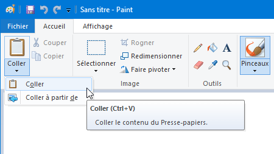
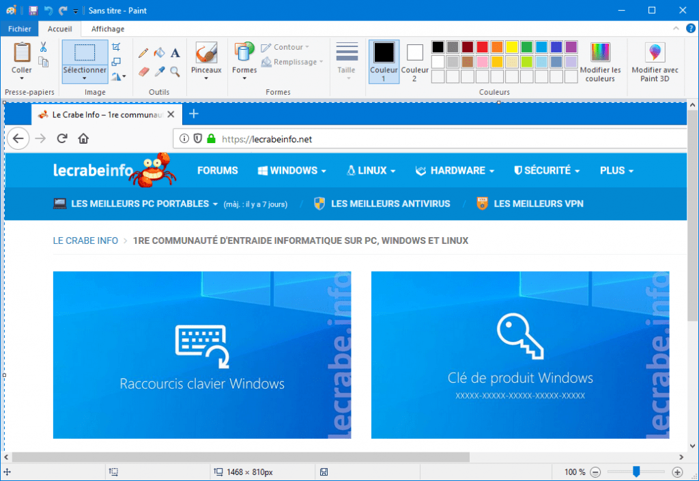
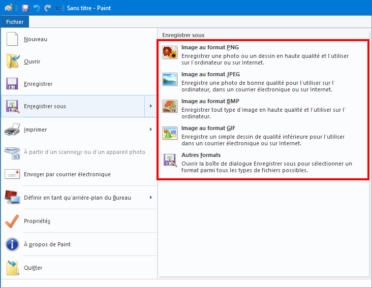
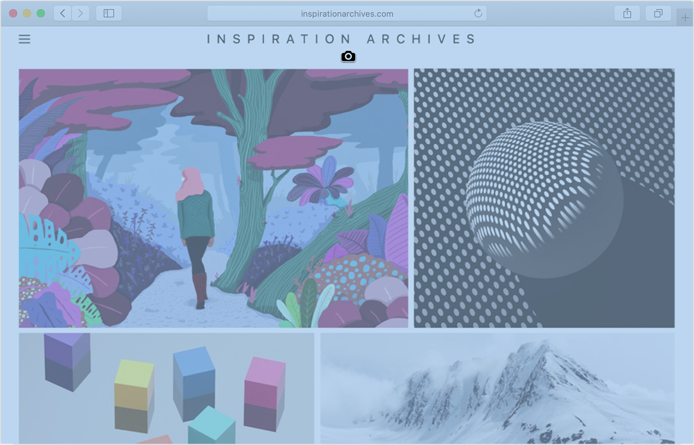

# Capture d'écran, tutoriel:
---

## Capture d'écran sur PC sous Windows 10, 8, 7

***Avec la touche Impr. écran***
C’est la solution la plus rudimentaire : elle permet de prendre une capture et de la placer dans le Presse-papier.

Après, vous devrez utiliser Paint ou votre logiciel d’édition graphique préféré pour coller la zone capturée (vous pourrez si besoin l’éditer pour ne garder que ce qui vous intéresse) et l’enregistrer dans un fichier image.

### Voici comment procéder :

1 -Capturez la zone de l’écran désirée :

   - Pour capturer la **totalité de l’écran** : appuyez sur la touche ``Impr. écran``.
   - Pour capturer **uniquement la fenêtre active** : appuyez simultanément sur les touches ``Alt`` + ``Impr. écran``.

2 - La zone capturée est à présent placée dans le Presse-papier.

3 - Ouvrez ensuite ***Paint*** ou votre logiciel d’édition graphique (comme GIMP ou Paint.NET) puis collez votre capture avec ``Ctrl`` + ``V``.

4 - Votre capture s’affiche alors dans le logiciel. Si besoin, vous pouvez redimensionner ou rogner l’image.

5 - Il ne vous plus qu’à enregistrer votre capture d’écran en tant que fichier image dans le format de votre choix et le tour est joué !

 **Félicitations ! Vous savez maintenant comment faire une capture d’écran en utilisant la touche Imp. écran ! 👍**

---

## capture d’écran sur un Mac
---
Vous pouvez effectuer une capture d’écran d’une fenêtre ou encore de l’intégralité ou d’une partie spécifique de l’écran.

***Procédure à suivre pour prendre une capture d’écran sur votre Mac***

1 - Pour effectuer une capture d’écran, appuyez simultanément sur ces trois touches et maintenez-les enfoncées : Maj, Commande et 3.

2 - Si vous voyez une miniature dans le coin de votre écran, cliquez dessus pour modifier la capture d’écran. Vous pouvez également attendre que la capture d’écran soit enregistrée sur votre bureau.

---

***Effectuer une capture d’une partie de votre écran***

1 - Appuyez simultanément sur ces trois touches et maintenez-les enfoncées : Maj, Commande et 4.

2 - Faites glisser le pointeur en croix  afin de sélectionner la zone de l’écran à capturer. Pour déplacer la sélection, maintenez la barre d’espace enfoncée tout en faisant glisser la sélection. Pour annuler la capture d’écran, appuyez sur la touche Échap.

3 - Pour prendre la capture d'écran, relâchez le bouton de la souris ou du trackpad.

4 - Si vous voyez une miniature dans le coin de votre écran, cliquez dessus pour modifier la capture d’écran. Vous pouvez également attendre que la capture d’écran soit enregistrée sur votre bureau.

***Effectuer une capture d’une fenêtre ou d’un menu***

1 - Ouvrez la fenêtre ou le menu que vous souhaitez capturer.

2 - Appuyez simultanément sur ces quatre touches et maintenez-les enfoncées : Maj, Commande, la barre d’espace et la touche 4. Le curseur prend la forme d’un appareil photo  . Pour annuler la capture d’écran, appuyez sur la touche Échap.

3 - Cliquez sur la fenêtre ou sur le menu pour le capturer. Maintenez la touche Option enfoncée lorsque vous cliquez sur la fenêtre afin d’exclure de la capture d’écran les zones d’ombre de la fenêtre.

4 - Si vous voyez une miniature dans le coin de votre écran, cliquez dessus pour modifier la capture d’écran. Vous pouvez également attendre que la capture d’écran soit enregistrée sur votre bureau.

---

## Emplacement des captures d’écran.

Par défaut, les captures d’écran sont enregistrées sur votre bureau sous le nom « Capture d'écran [date] à [heure].png ».

Dans macOS Mojave ou une version ultérieure, vous pouvez modifier l’emplacement par défaut des captures d’écran enregistrées dans le menu Options de l’app Capture d’écran. Vous pouvez également faire glisser la miniature vers un dossier ou un document.

---

# Capture d’écran, ou de zones d’écran (screenshots) sous Ubuntu.
---
***Réaliser une capture d'écran (image)***

Il est possible d'effectuer des captures d'écran de son ordinateur. Par défaut, sous Ubuntu, la capture "image" d'écran s'effectue avec l'outil gnome Screenshot.

On peut également réaliser des captures qui seront enregistrées dans le répertoire "Images" de l'utilisateur avec un nom de la forme "Capture d’écran de [date] [heure].png" par des raccourcis clavier :

``impr-écr`` : copie de l'écran entier,

``alt+impr-écr`` : copie de la fenêtre active,

``maj+impr-écr`` : initie une capture d'une zone rectangulaire à tracer.
