# Jeux libres de droits "open Sources"

***Memory Yoga Cards Game***

***Sort the Waste Game***

***Match 3 Yoga Game***

***Remake Earth Puzzle Game***

***Tetris Classic Game***

---
### Jeux testés et vérifiés sous :
  - Windows 10 professional edition
  - Windows 7 family edition
  - Mac osx Catalina
  - Ubuntu 18.04
---

## Démo
---

***Démo de Memory Yoga Cards Game***
---
A l'arrivé :
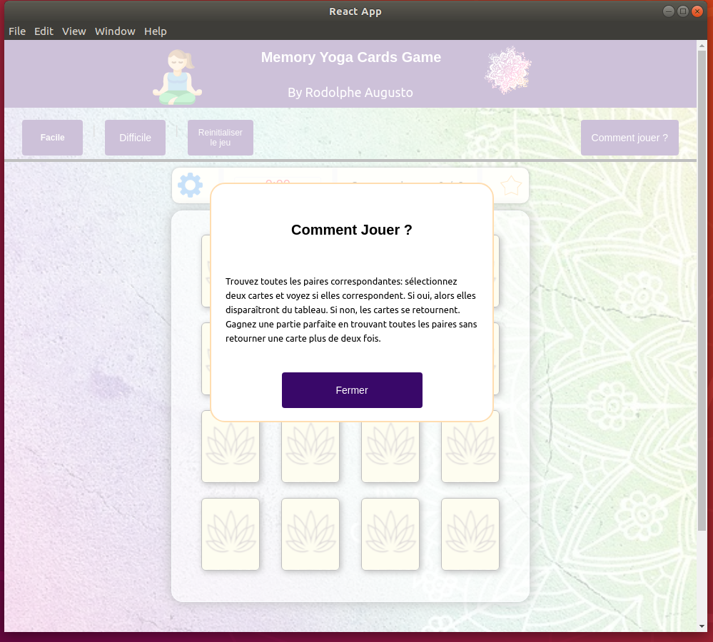

Board de jeu
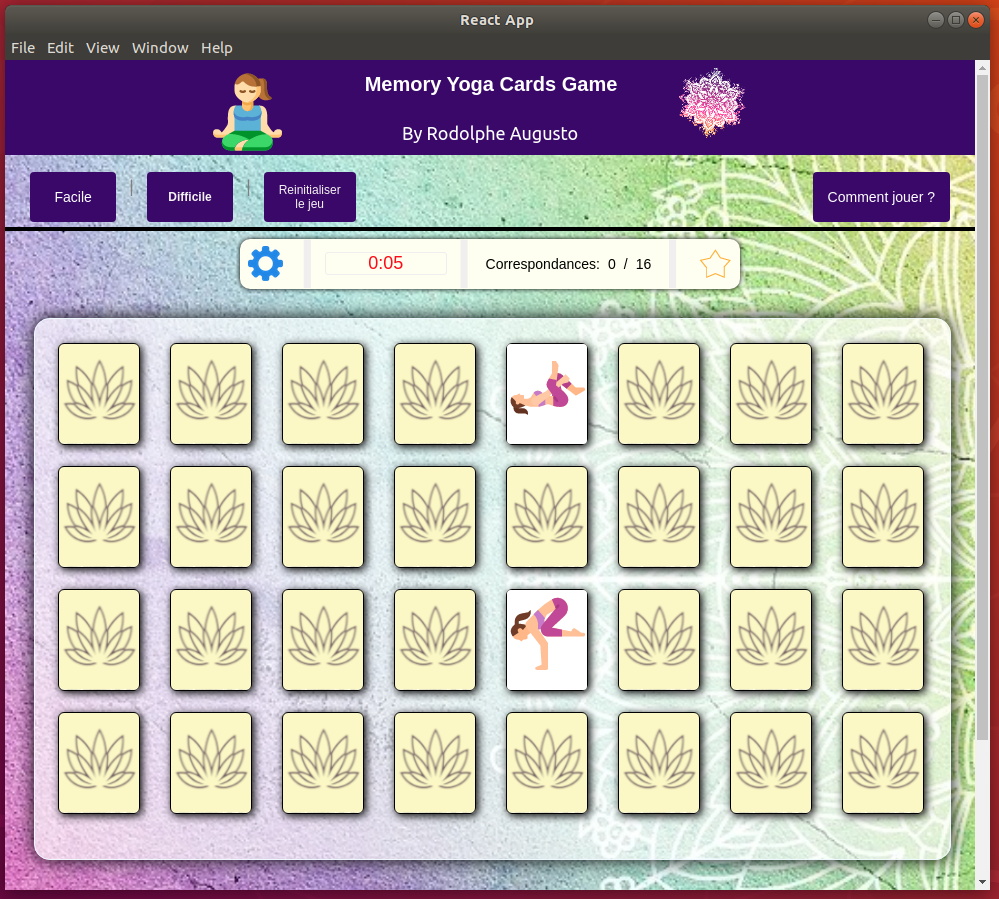

***Démo de Sort the Waste Game***
---
A l'arrivé :
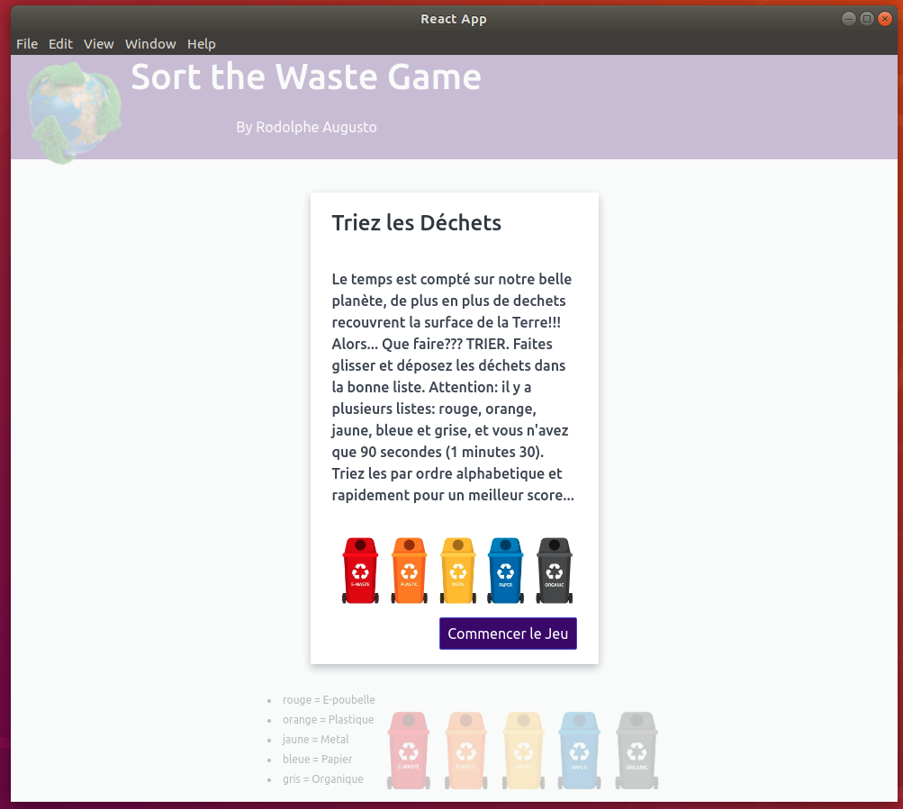

Board de jeu
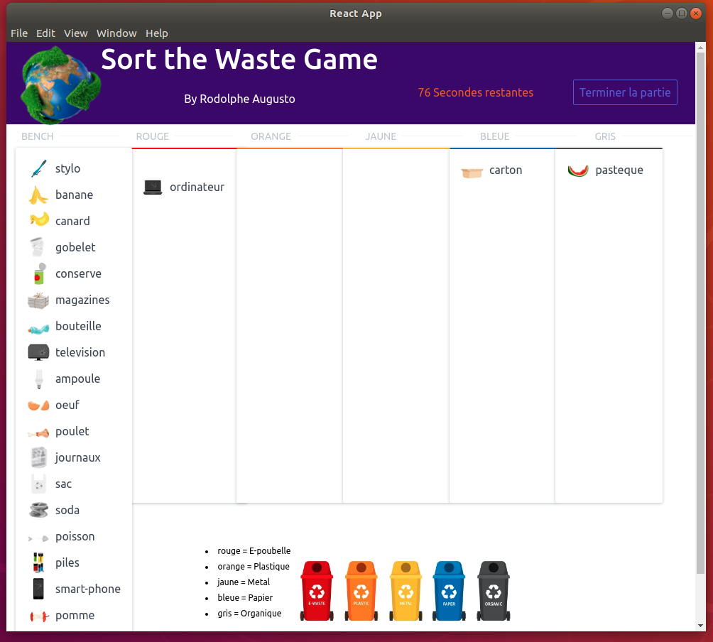

***Démo de Match 3 Yoga Game***
---
A l'arrivé :
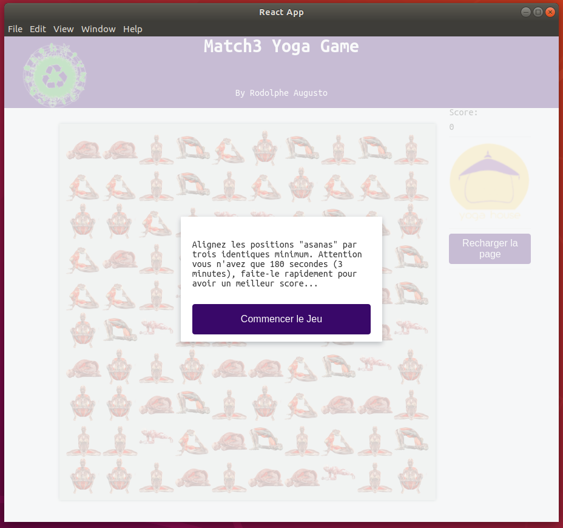

Board de jeu
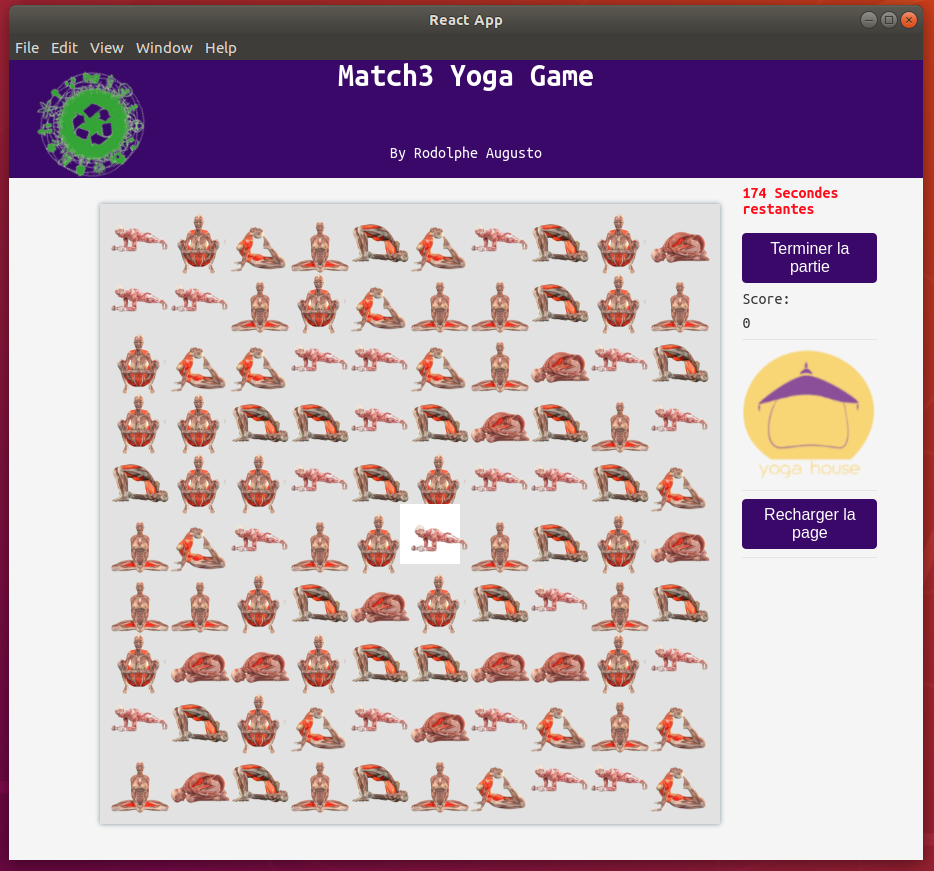

Déplacements
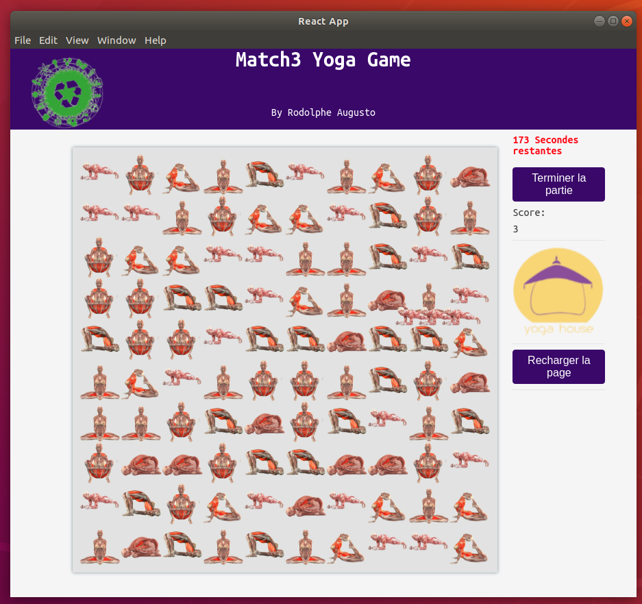

***Démo de Remake Earth Puzzle Game***
---
A l'arrivé :
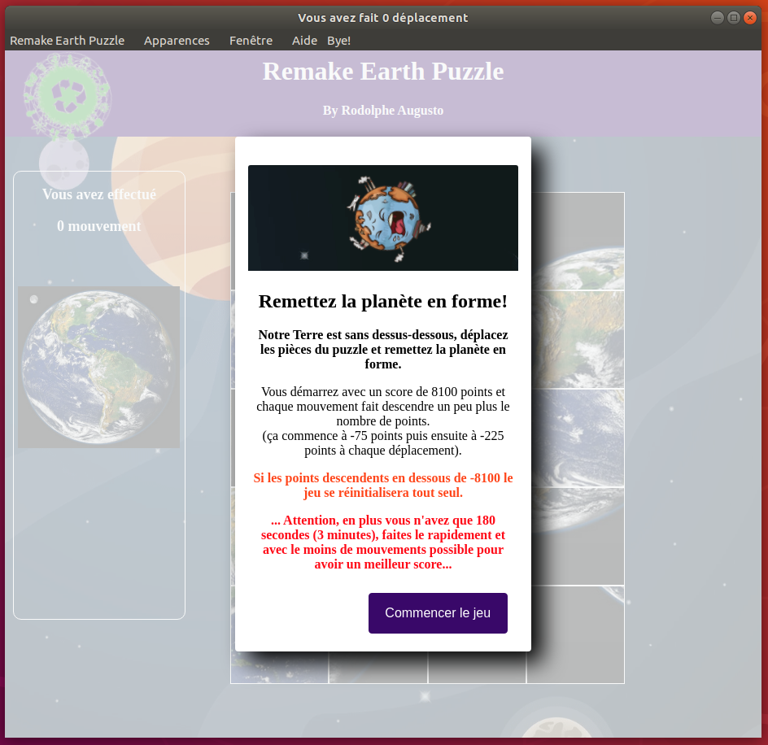

Board de jeu
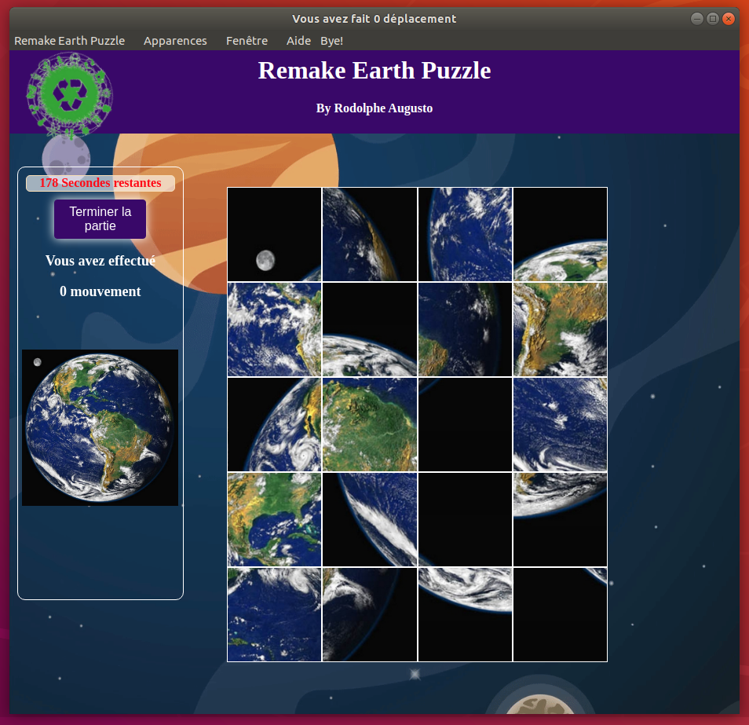

Victoire
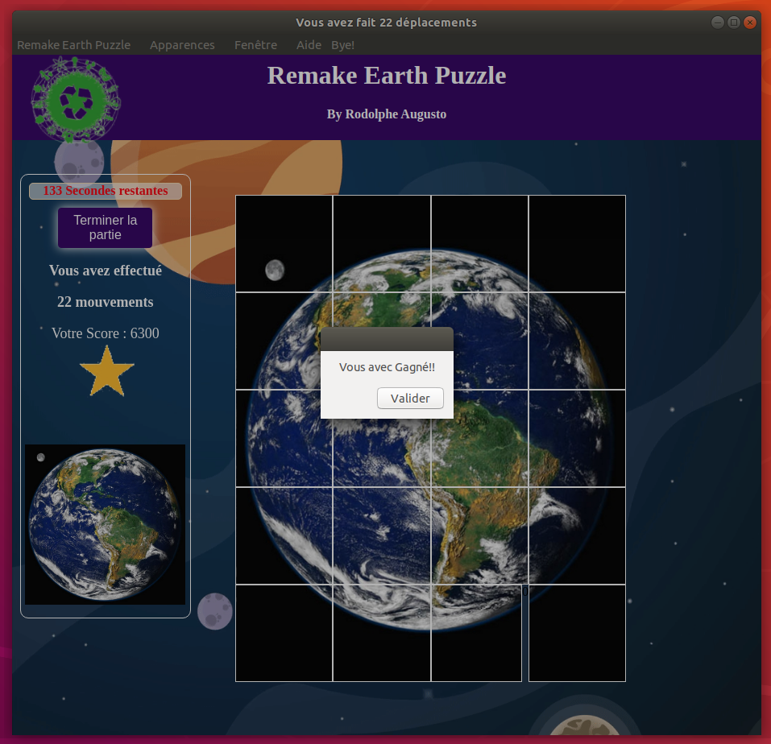

***Démo de Tetris Classic Game***
---
A l'arrivé :
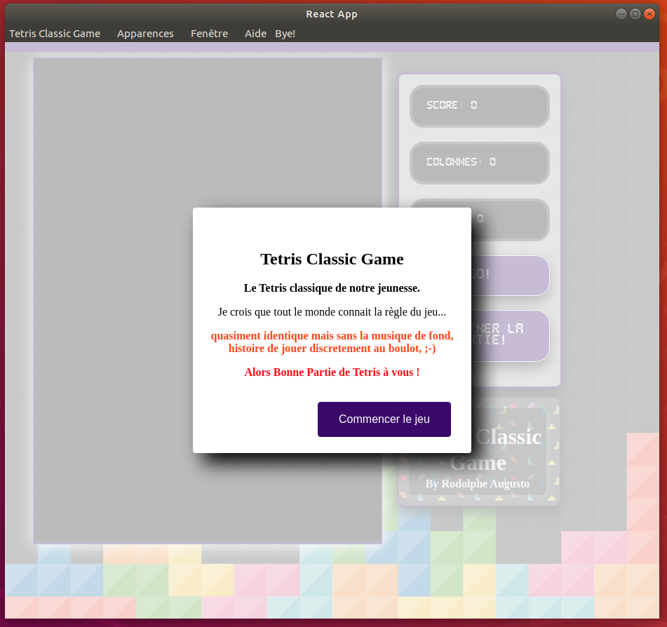

Board de jeu
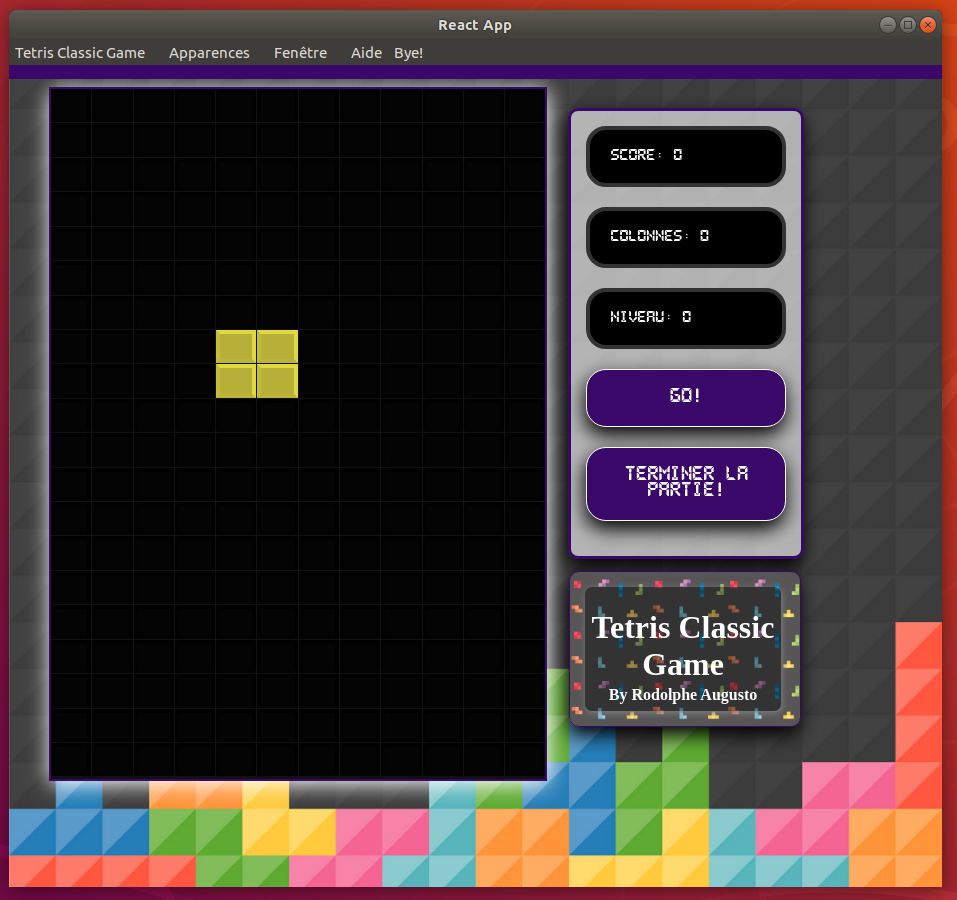

---
## Téléchargements et Méthodes d'installation

C'est par Là !

[installation](https://github.com/rodolphe37/install-games-repository/blob/master/tutoriel-installation-games/INSTALLATION.md)

## Idées et Histoire des jeux !

- Mon idée est de sensibiliser les personnes à la préservation de la nature et de sa propre santé.
  Dans cette serie de jeux, le sujet principal est soit la sensibilisation au tri des dechets, de la prise de conscience que la santé de notre planète n'est pas indéfinie, ou bien, que votre santé est importante pour votre avenir et celle de notre belle planète de surcroit.

  Par le biais de jeux ludiques et accessibles à tous, je souhaite réveiller la conscience individuelle et collective du fait que notre destin, ainsi que celui de la Terre sont liés, et que sans vous la planète ne pourra survivre à notre folie incontrolée et notre innocence démesurée.

  De ce fait, j'ai créer ces jeux afin qu'il soit ludique pour toutes personnes et de tous âges.... c'est une goutte d'eau dans l'océan dira t'on, mais l'ocean est constituée de milliard de goutte... donc, il faut bien commencer quelque part.

  Je suis intimmement convaincu que l'aspect ludique est notre salut quant au reveil de tous aux enjeux en cours en ce moment.

---
