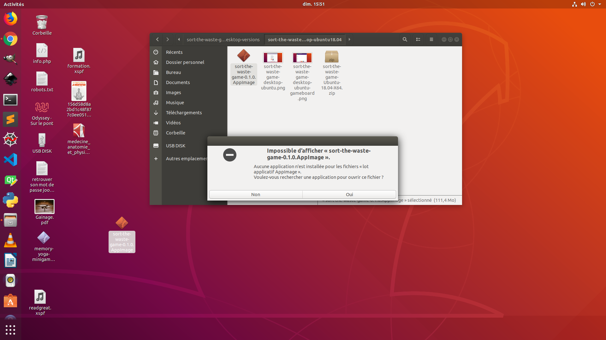

# Installation des jeux

***Memory Yoga Cards Game***

***Sort the Waste Game***

***Match 3 Yoga Game***

***Remake Earth Puzzle Game***

***Tetris Classic Game***

---
## Liens Rapides

[Installation sous Windows](#installation-sous-windows)
  - [Télécharger le zip pour Windows](#t%c3%a9l%c3%a9charger-le-zip)
  - [Couper - coller les fichiers](#couper---coller-les-fichiers)
  - [Créer un raccourci](#cr%c3%a9er-un-raccourci)

[Installation sous Mac osx](#installation-sous-mac-osx)
  -  [Télécharger le zip pour Mac osx](#t%c3%a9l%c3%a9charger-le-zip-pour-mac-osx)
  -  [un fichier dmg](#un-fichier-dmg)
  -  [Allez dans votre Laucher...](#allez-dans-votre-Laucher-pour-voir-vos-applications)
      - [Icone n'apparait pas ?](#si-l-'-icone-n-'-apparait-pas)

[Installation sous Ubuntu](#installation-sous-ubuntu)
  - [Télécharger le zip pour Ubuntu](#t%c3%a9l%c3%a9charger-le-zip-pour-ubuntu)
  - [Erreur au démarrage](#erreur-au-d%c3%a9marrage)
  - [Autoriser l'execution](#Autoriser-l-execution-comme-programme)

---
## Installation sous Windows

---
### Télécharger le zip

1. procurez vous le fichier zip
  - [Memory Yoga Game pour Windows](https://github.com/rodolphe37/install-games/tree/master/memory-yoga-game-all-versions/windows/memory-yoga-minigame-win10-x64.zip)
  - [Sort The Waste Game pour Windows](https://github.com/jn-html/sort-the-waste-game-desktop-versions/blob/master/windows/sort-the-waste-game-win10-X64.zip)
  - [Match 3 Yoga Game pour Windows](https://github.com/rodolphe37/install-games/tree/master/match-3-yoga-game-all-versions/windows/match-3-yoga-game-windows-x64.zip)
  - [Tetris Classic Game pour Windows](https://github.com/rodolphe37000/tetris-classic-game-desktop-version/blob/master/windows/Tetris-Classic-Game-Windows-X64.zip)
  - [Remake Earth Puzzle Game pour Windows](https://github.com/rodolphe37000/remake-earth-puzzle-game-desktop-version/blob/master/windows/Remake%20Earth%20Puzzle%20V3.0-final-%20Windows.zip)

ouvrez un nouvel onglet de navigateur :

 Cliquez sur le bouton "Download" :

 Téléchargez le fichier .zip :

1. Dézipper l'archive sur votre bureau par exemple (ça n'est que provisoire)

---
### Couper - coller les fichiers

Une fois dézippé, cliquez droit sur le dossier et faite "couper"

Rendez-vous dans votre dossier programmes qui se situe dans votre Disque local et faite "coller"

Une fenêtre s'ouvre en vous proposant d'ignorer, d'annuler ou de continuer, cliquez sur "Continuer"

Attendez que le transfert se termine...

---
### Créer un raccourci

Double cliquez sur le dossier fraîchement collé, ensuite cliquez droit sur "memory-yoga-minigame.exe" et cliquez sur "créer un raccourci"

Un message vous dit que ça n'est pas possible de faire un raccourci dans ce dossier, "voulez vous créer un raccourci sur le bureau", cliquez sur "oui".

Vous vous retrouvez donc avec un raccourci fraîchement créé sur le bureau et les reste des fichiers dans votre dossier ... Tout va bien, c'est quasiment fini.

Cliquez droit sur le raccourci afin de le renommer

Enlevez la fin, il ne doit rester que "memory-yoga-minigame" rien de plus. :smiley:

Il ne vous reste plus qu'à double cliquez sur le raccourci....

... et commencer à jouer !

Enjoy :sunglasses:

---

## Installation sous Mac Osx

---
### Télécharger le zip pour Mac osx

1. procurez vous le fichier zip
  - [Memory Yoga Game pour Mac](https://github.com/rodolphe37/install-games/tree/master/memory-yoga-game-all-versions/mac-osx/memory-yoga-minigame-0.1.0-Mac-osx-Catalina.zip)
  - [Sort The Waste Game pour Mac](https://github.com/jn-html/sort-the-waste-game-desktop-versions/blob/master/mac-osx/sort-the-waste-game-Mac-osx-Catalina.zip)
  - [Match 3 Yoga Game pour Mac](https://github.com/rodolphe37/install-games/tree/master/match-3-yoga-game-all-versions/mac-osx/drag-and-drop-yoga-game-0.1.0-Mac-osx.zip)
  - [Tetris Classic Game pour Mac](https://github.com/rodolphe37000/tetris-classic-game-desktop-version/blob/master/mac/Tetris-Classic-Game-Mac-osx.zip)
  - [Remake Earth Puzzle Game pour Mac](https://github.com/rodolphe37000/remake-earth-puzzle-game-desktop-version/blob/master/mac/Remake%20Earth%20Puzzle-V-3.0-final-release.Mac-osx.zip)

ouvrez un nouvel onglet de navigateur :

 Cliquez sur le bouton "Download" :

 Téléchargez le fichier .zip :

1. Dézipper l'archive sur votre bureau par exemple.

---
### un fichier dmg

Une fois dézippé double cliquez sur le fichier dmg afin de lancer l'installation !!!

---
### Allez dans votre LaunchPad pour voir vos Applications

en cliquant sur le launchPad vous permettant de voir vos appli installées, vous voyez à présent un icon avec le nom du jeu

### si l'icone n'apparait pas

si l'icone n'apparait pas dans le launchPad , en l'occurence là c'est l'icone du jeu Match 3 Yoga Game (icone : drag-and-drop-yoga-game) qui n'y figure pas...

... dans ce cas, allez dans votre dossier Applications et cliquez sur l'icone qui est bien présent dans ce dossier, vous pouvez faire un raccourci sur votre bureau si vous le souhaitez. Sinon...

Il ne vous reste plus qu'à cliquez sur l'icone et à commencer à Jouer !

Enjoy :sunglasses:

---

## Installation sous Ubuntu

---
### Télécharger le zip pour Ubuntu

1. procurez vous le fichier zip
    - [Memory Yoga Game pour Linux](https://github.com/rodolphe37/install-games/tree/master/memory-yoga-game-all-versions/linux/memory-yoga-minigame-0.1.0-ubuntu.zip)
    - [Sort The Waste Game pour Linux](https://github.com/jn-html/sort-the-waste-game-desktop-versions/blob/master/linux/sort-the-waste-game-Ubuntu-18.04-X64.zip)
    - [Match 3 Yoga Game pour Linux](https://github.com/rodolphe37/install-games/tree/master/match-3-yoga-game-all-versions/linux/match-3-yoga-game-0.1.0-linux-x64.zip)
    - [Tetris Classic Game pour Linux](https://github.com/rodolphe37000/tetris-classic-game-desktop-version/blob/master/linux/Tetris-Classic-Game-Ubuntu-amd64.zip)
    - [Remake Earth Puzzle Game pour Linux](https://github.com/rodolphe37000/remake-earth-puzzle-game-desktop-version/blob/master/linux/Remake%20Earth%20Puzzle-V-3.0-Final-Ubuntu.zip)

 ouvrez un nouvel onglet de navigateur :

 Cliquez sur le bouton "Download" :

 Téléchargez le fichier .zip :

1. Dézipper l'archive sur votre bureau.

---
### Erreur au démarrage

Une fois dézippé, si vous double cliquez sur le fichier ".AppImage" il est possible que vous vous retrouviez face à ça !!! Il faut autoriser l'execution... Sinon vous pouvez vous rendre à l'étape suivante... Jouer :zap:

---
### Autoriser l'execution comme programme

Cliquez droit sur le fichier et rendez vous à l'onglet "Permissions", cliquez sur "Autoriser l'execution du fichier comme programme", ensuite, vous pouvez fermer la fenêtre.

Il ne vous reste plus qu'à double cliquez sur le fichier et à Jouer ! :grin:

Enjoy :sunglasses:

---
